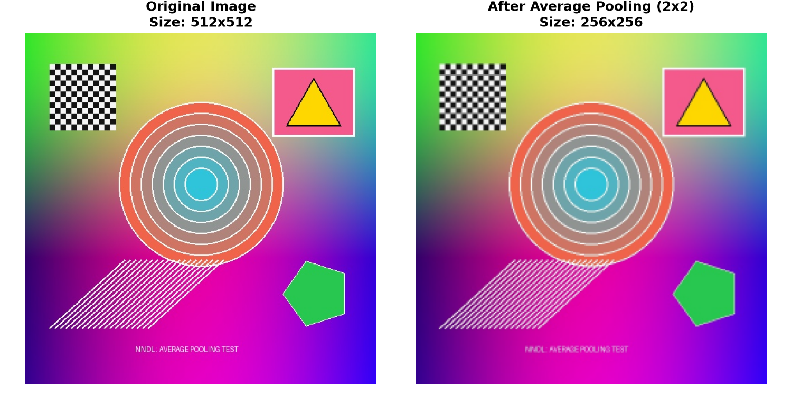

# Implementation of Average Pooling on a Sample Image

[-blue.svg)](#)
[](#)
[](#)

A **Problem Based Learning (PBL)** project for **Neural Networks and Deep Learning (NNDL)** demonstrating the mathematical formulation, implementation, and visual results of **2D Average Pooling** on a sample image.

---

## 👨‍🎓 Student Details
* **Student Name:** Om Rajiv Polakhare
* **Roll No / ID:** CM23062
* **Course:** B.Tech CSE (Artificial Intelligence & Machine Learning), 7th Semester
* **Institute:** S. B. Jain Institute of Technology, Management and Research, Nagpur
* **Guide:** Dr. Bhushan Manjre (Assistant Professor)

---

## 📌 Project Overview
Pooling layers are fundamental components of Convolutional Neural Networks (CNNs). This project implements **2D Average Pooling from scratch using Python and NumPy** (without relying on pre-built deep learning wrappers) and evaluates its spatial downsampling and feature smoothing effects on an RGB sample image.

### Key Highlights:
1. **Mathematical Implementation:** Slides a $2 \times 2$ window across an image with stride 2 and calculates the local arithmetic mean.
2. **Spatial Reduction:** Halves the spatial dimensions ($512 \times 512 \to 256 \times 256$), achieving an exact **75.00% reduction** in spatial data.
3. **Zero Parameters:** Operates with 0 learnable weights and biases, reducing computation and controlling overfitting.
4. **Noise Suppression:** Acts as a spatial low-pass filter, smoothing out fine high-frequency noise while retaining macro-structures.

---

## 📐 Mathematical Formulation

For an input image or feature map $X$ of shape $(H, W, C)$ with pooling kernel size $K \times K$ and stride $S$:

$$\text{Output}(i, j, c) = \frac{1}{K \times K} \sum_{m=0}^{K-1} \sum_{n=0}^{K-1} X(i \cdot S + m, j \cdot S + n, c)$$

### Output Dimension Formula:
$$H_{out} = \left\lfloor \frac{H - K + 2P}{S} \right\rfloor + 1, \quad W_{out} = \left\lfloor \frac{W - K + 2P}{S} \right\rfloor + 1$$

---

## 🖼️ Visual Output

Below is the side-by-side comparison generated by running the project:



* **Original Input Image:** $512 \times 512$ (RGB)
* **After Average Pooling ($2 \times 2$, Stride 2):** $256 \times 256$ (RGB)
* **Data Reduction:** $75.00\%$

---

## 🚀 Quick Start (How to Run)

### 1. Clone the Repository
```bash
git clone https://github.com/YOUR_USERNAME/NNDL-PBL-Average-Pooling.git
cd NNDL-PBL-Average-Pooling
```

### 2. Install Dependencies
```bash
pip install -r requirements.txt
```

### 3. Run the Script
```bash
python average_pooling.py
```

---

## 📂 Repository Structure
```
├── average_pooling.py                  # Core 2D Average Pooling implementation
├── sample.jpg                          # Input test image (512x512 RGB)
├── pooled_sample.jpg                   # Generated pooled output image (256x256 RGB)
├── comparison_result.png               # Side-by-side comparison plot
├── requirements.txt                    # Project dependencies
├── .gitignore                          # Ignored temporary files
└── README.md                           # Documentation
```
